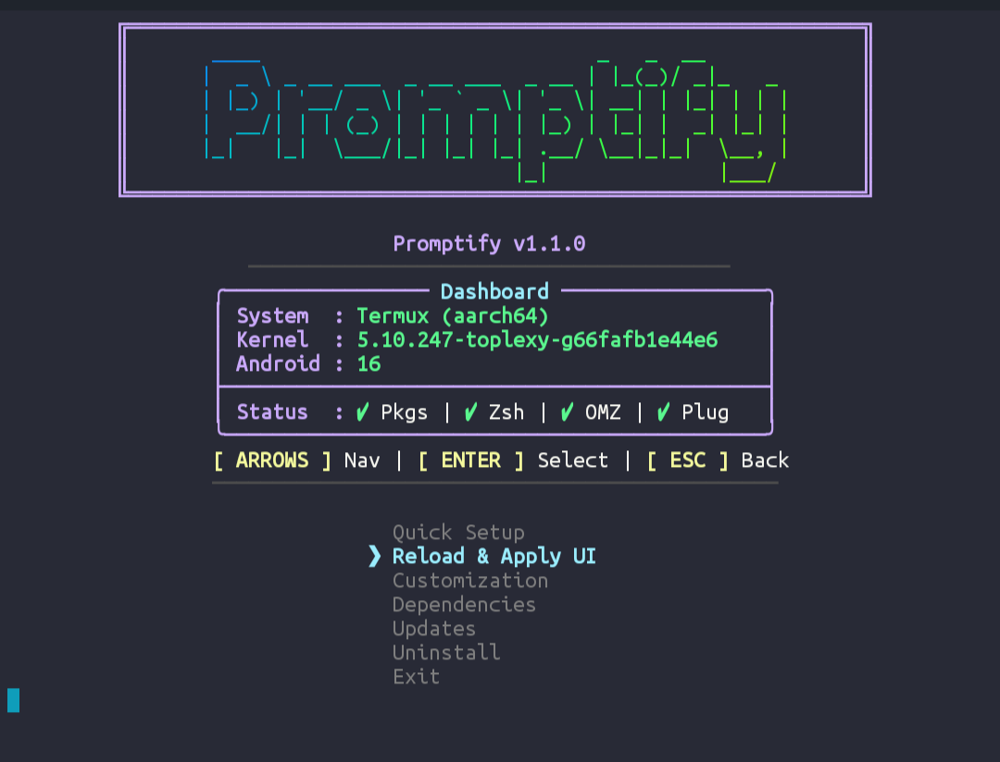
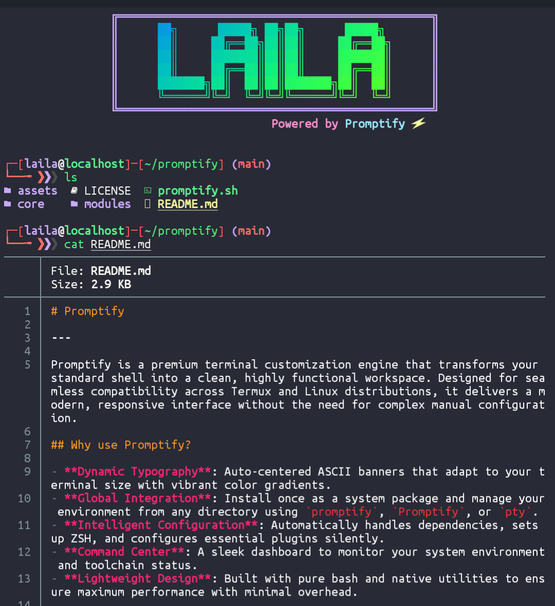
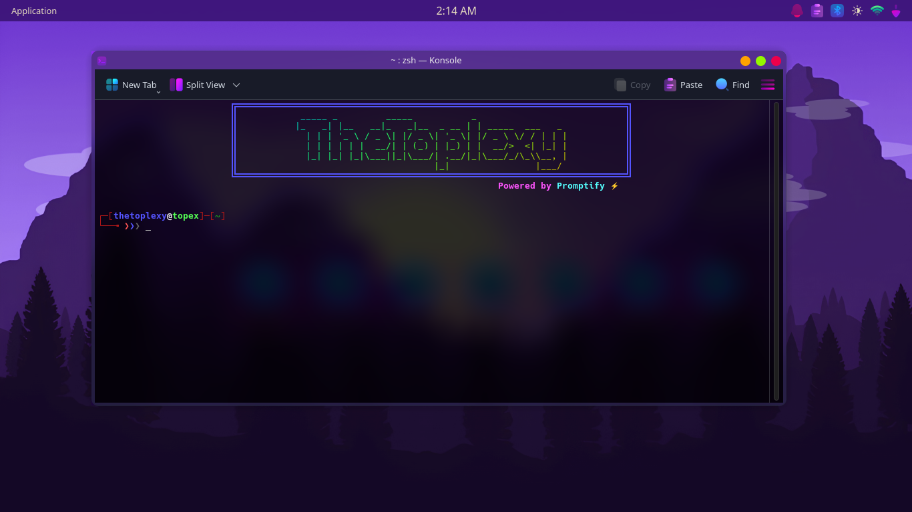
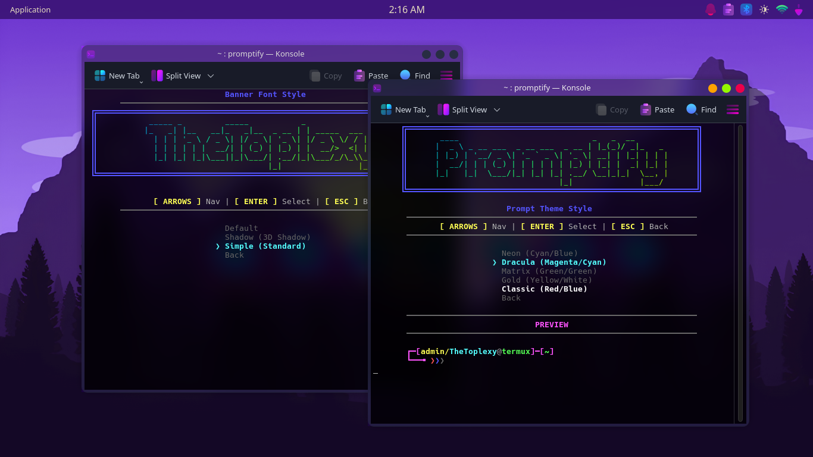
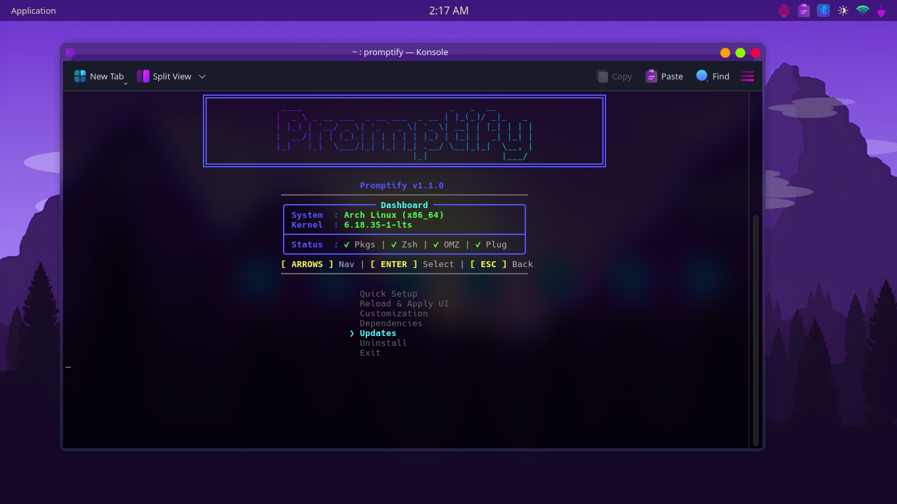

# Promptify

---

Promptify is a premium terminal customization engine that transforms your standard shell into a clean, highly functional workspace. Designed for seamless compatibility across Termux and Linux distributions, it delivers a modern, responsive interface without the need for complex manual configuration.

## Why use Promptify?

- **Dynamic Typography**: Auto-centered ASCII banners that adapt to your terminal size with vibrant color gradients.
- **Global Integration**: Install once as a system package and manage your environment from any directory using `promptify`, `Promptify`, or `pty`.
- **Intelligent Configuration**: Automatically handles dependencies, sets up ZSH, and configures essential plugins silently.
- **Command Center**: A sleek dashboard to monitor your system environment and toolchain status.
- **Lightweight Design**: Built with pure bash and native utilities to ensure maximum performance with minimal overhead.

## Previews

Promptify scales perfectly from mobile screens to ultrawide PC monitors.

**Mobile Experience:**
| | |
|:---:|:---:|
|  |  |

**Desktop Experience:**
| | | |
|:---:|:---:|:---:|
|  |  |  |

---

## Installation

Run this single command to start the transformation:

```bash
bash <(curl -fsSL https://raw.githubusercontent.com/TopexGuy/promptify/refs/heads/main/promptify.sh)
```

## Post-Installation Commands

| Command | Action |
|:---|:---|
| `promptify` / `pty` | Open the management menu and settings |
| `ls` / `l` | See your files with beautiful icons and colors |
| `cat` | Read files with professional code highlighting (Syntax Highlighting) |

## Customization

You can change your look anytime by running `promptify`:
- **Change Banner**: Update the name or text at the top of your terminal.
- **Switch Fonts**: Choose between Random, Shadow, Simple, Slant, Banner, Poison, or Graffiti styles (Slant, Banner, Poison, and Graffiti support lowercase letters).
- **Prompt Themes**: Switch between Neon, Matrix, Dracula, and more.

## What's New in v1.3.0?

- **New Banner Fonts**: Slant, Banner, Poison, and Graffiti styles bundled as assets — all with lowercase support (Bubble removed).
- **Random Font Option**: The default option now picks a random banner style on every terminal open for a fresh look each time.
- **Minimal Banner Box**: Removed the extra vertical padding rows so the banner box hugs the glyphs for a clean, compact look.

## What's New in v1.2.0?

- **Cat Style**: Professional code highlighting for the `cat` command with style presets.
- **Power Tools**: Optional Eza (modern `ls`) and Bat (modern `cat`) installs.
- **Nerd Fonts**: Auto-installed on desktop terminals for crisp glyphs.
- **Live Output**: Real-time progress while installing and applying.
- **Disabled Items**: Unavailable options now show grayed-out in menus.

[See the full Changelog here](.github/CHANGELOG.md)

## Acknowledgments & Credits

Promptify stands on the shoulders of giants. Special thanks to the following projects:

- **[T-Header](https://github.com/remo7777/T-Header)**: For the inspiration and foundational ASCII drawing assets used in our modular header system.
- **[Oh My Zsh](https://github.com/ohmyzsh/ohmyzsh)**: The delightful framework for managing Zsh configuration.
- **[zsh-autosuggestions](https://github.com/zsh-users/zsh-autosuggestions)** & **[zsh-syntax-highlighting](https://github.com/zsh-users/zsh-syntax-highlighting)**.

## Uninstall

Don't like it? No problem. Uninstalling is just as easy:
1. Type `promptify`.
2. Select **Uninstall**.
3. Your terminal will be back to original in seconds.

## License

This project is licensed under the MIT License.
